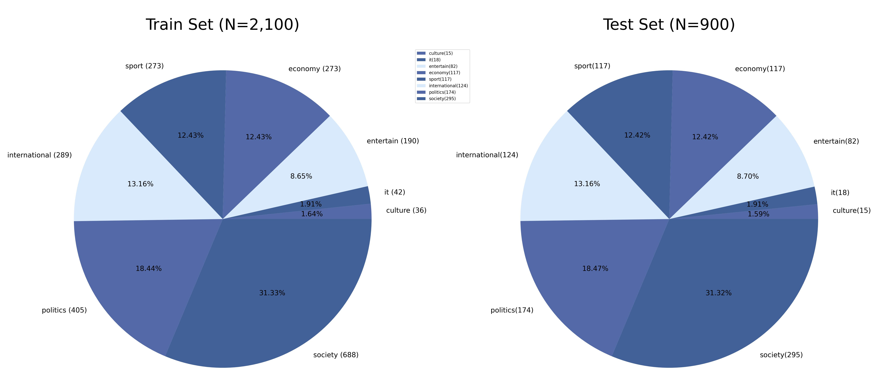
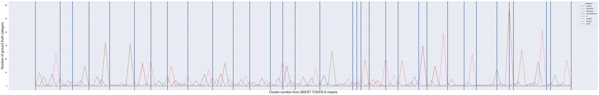
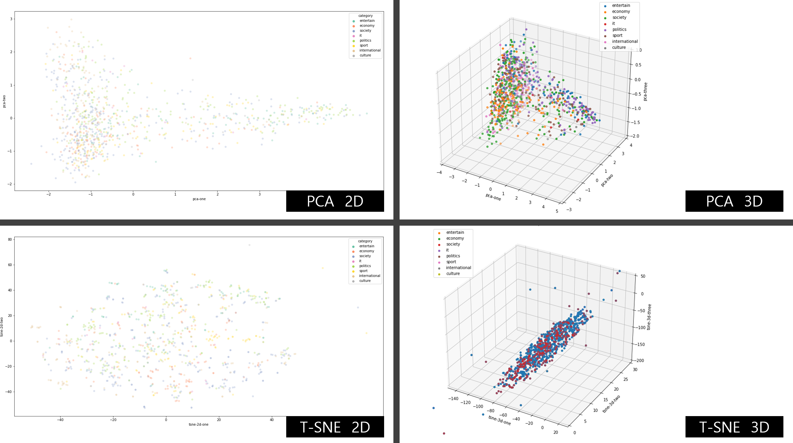
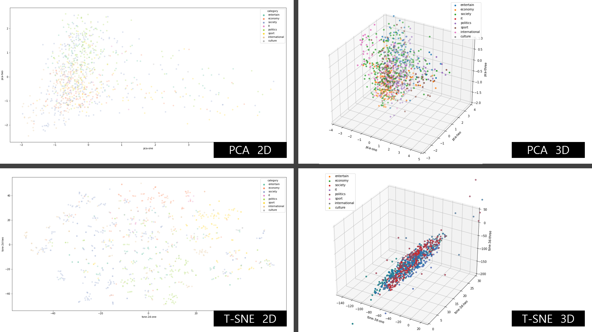

# Korean-news-topic-classification-using-KO-BERT
[](code_of_conduct.md)


> **Be careful when cloning this repository**: It contains large NLP model weight. (>0.3GB, [`git-lfs`](https://git-lfs.com/)) <br>
> If you want to clone without git-lfs, use this command before `git clone`.
```
git lfs install --skip-smudge &
export GIT_LFS_SKIP_SMUDGE=1
```
 
 Fine-Tuned Korean BERT News Article Classifier

### Abstract:
With the growing importance of natural language processing in the field of artificial intelligence, the development of high-performance models for text classification tasks has become increasingly crucial. In this study, I propose a fine-tuned Korean BERT (Bidirectional Encoder Representations from Transformers) news article classifier, which is capable of accurately classifying Korean news articles into one of eight pre-defined categories. I compare the performance of KO-BERT and BERT implementations in different frameworks, including PyTorch, APACHE MXNET GluonNLP, and Hugging-Face, using the Korean News Topic Classification Dataset collected and provided privately by a specific company. My experimental results show that the fine-tuned KO-BERT model outperforms the BERT model, achieving an accuracy of 88.95%. I also investigate the impact of pre-trained clustering information from SBERT (Sentence-BERT) on the fine-tuned KO-BERT model and show that it can further enhance the model's performance. My study demonstrates the effectiveness of fine-tuning pre-trained language models for text classification tasks and provides insights into the optimal use of clustering information in improving the model's performance.

##### Keywords: BERT, KO-BERT, text classification, natural language processing, deep learning, pre-training, fine-tuning, SBERT

Not official research.


<br><br><br><br><br><br><br><br>

# Overview
- For resource reasons, [KOBERT](https://sktelecom.github.io/project/kobert) was used as a submodule which are the following two folders. 
- `src/kobert`, `src/kobert_hf` (Red nodes in graphviz)


<br><br><br><br><br><br><br><br>

# Contents
- [This repository](#this-repository)
- [Quick Start](#quick-start)
- [Outline](#outline)
- [Results](#results)
- [Experiments](#experiments)
- [Evaluation](#evaluation)
- [Discussion](#discussion)
- [References <Br>](#references--br-)


<br><br><br><br><br><br><br><br><br><br><br><br><br>


# TASK: Multi-category(8 classes) Korean News Topic Classifier 
A multi-category Korean news topic classifier model. <Br>
- Compare the performance of KO-BERT and BERT implementations in different frameworks by performing a simple task. <br>
- Frameworks used: PyTorch, APACHE MXNET GluonNLP, and Hugging-Face for modeling, and Scikit-Learn for calculating evaluation metrics.
- Pre-trained model: [`KO-BERT`](https://github.com/SKTBrain/KoBERT), `BERT`, [`SBERT`](https://www.sbert.net/)
- Dataset: Korean News Topic Classification Dataset (collected and provided privately by a specific company) <br>
- Evaluation: Accuracy <br>
- Duration: Jan 16,2023 - Jan 19,2023 (4days) <br>
- Author: [Daniel Park, South Korea](https://github.com/DSDanielPark) <br>


### Sub Task 
- Comparison of BERT model implementations in GluonNLP, PyTorch, and Hugging-Face frameworks.
- Quantitative comparison of model classification performance using news titles, titles + article bodies, and article bodies alone as input.
- Comparison of model training speed when providing pre-clustering information using Multilingual-BERT (SBERT).
  - In PyTorch, information is embedded in the initial [CLS] token, and in GluonNLP, information about clustering is inserted into the input during the preprocessing stage.
  
<br>

# This repository
- Provides a fine-tuned MXNet GluonNLP BERT Classifier weight file (weights/ko-news-clf-gluon-weight.pth) through git-lfs, and a sample CSV file for inference (data/sample.csv).
- Will be distributed through pypi for universal use in the future.
- To-Do: Hugging Face framework, XAI, GPT2, GPT3, BERT Pipeline, etc.

### Repository folder tree
```
📦fine-tuned-korean-BERT-news-article-classifier 
 ┣ 📂data
 ┃ ┣ 📂csv
 ┃ ┣ 📂imgs
 ┃ ┣ 📜sample.csv                          # For inference (project input)
 ┃ ┣ 📜test_set.csv
 ┃ ┗ 📜train_set.csv
 
 ┣ 📂experiments                           # Dummies for experiments
 ┃ ┣ 📂experiment_weights
 ┃ ┣ 📜exp.md
 ┃ ┗ 📜exp_metric.md
 
 ┣ 📂notebooks                             # For developing features (will NOT be provided)

 ┣ 📂src
 ┃ ┣ 📂kobert                              # SKT KOBERT / references[2, 3]
 ┃ ┣ 📂kobert_gluon                        # Module for GluonNLP experiments.
 ┃ ┣ 📂kobert_hf                           # SKT KOBERT / references[2, 3]
 ┃ ┣ 📂kobert_pytorch                      # Module for torch bert experiments.
 ┃ ┣ 📂preprocess                          # Preprocessing module for this repository's experiments.

 ┣ 📂weights
 ┃ ┣ 📜ko-news-clf-gluon-weight.pth        # Will be provided throught git-lfs (>0.3 GB), MODE==2
 ┃ ┗ 📜ko-news-clf-torch-weight.pth        # Will NOT be provided (>1.0 GB), MODE==2

 ┣ 📜.gitattributes                        # Git-lfs managing
 ┣ 📜.gitignore
 ┣ 📜config.py                             # Config
 ┣ 📜LICENSE
 ┣ 📜main.py                               # main.py (providing only gluon inference)

 ┣ 📜README.md
 ┗ 📜requirements.txt
```

<br>

# Quick Start
This repository includes a highly encapsulated inference class for the BERT classifier.

```
$ git clone https://github.com/DSDanielPark/fine-tuned-korean-BERT-news-article-classifier.git
$ cd fine-tuned-korean-BERT-news-article-classifier
$ pip install -e .
$ python main.py
>>> Predicted news topic: international
```

<Br>

You can use follow optional args.
```
for gluon weight inference only

optional arguments:
  -h, --help            show this help message and exit
  --gluon_weight_path GLUON_WEIGHT_PATH                        # glouon weight file path
  --data_path DATA_PATH                                        # input csv data path
  --save_path SAVE_PATH                                        # save csv file full path
```

<br>

# Outline
- **Problem Definition:** 
<br> Create a model that classifies articles into the following 8 categories with the title and body as input.
<br> `Categories` = ['society', 'politics', 'international', 'economy', 'sport', 'entertain', 'it', 'culture'] <br><br>
- **Data Description:**
<br> The Total 3,000 korean news dataset(Train: 2,100 articles, Test 900: articles, 7:3 split) consist of title, body and category columns. <br>


        ```
        title: korean article title
        cleanBody: korean article body
        category: of article (eight classes)
        ```

  |  | title |cleanBody|category|
  |---:|:---|:---|:---|
  |  0 | 보건복지부, 새해 청년과 지역이 함께 지역사회서비스를 개발제공해 사회서비스 고도화에 앞장서 | 보건복지부(장관 조규홍)는 2023년 청년사회서비스사업단(이하 ‘청년사업단’)선정 및 운영을 위해 오는 1월 27일(금)부터 2월 15일(수)까지 약 3주간 전국 17개 시도(광역 지자체)를 대상으로 청년사업단 공모를 실시한다고 밝혔습니다. ...(중략)... 본 기사는 깃허브 데이터 예시를 위해 보건복지부 보도자료를 참조하여 생성하였습니다. | society    |


<br>

- **EDA:**
<br> The dataset used for the analysis was of high quality and well-refined, hence no outliers were found. As the dataset was specifically processed by a Korean IT company, there was no need for further data preprocessing.
  <br> 
   *Fig 1. The data distribution between the test and training sets was examined, and imbalance was not considered as it was feasible to collect additional data and train the model with it.*

<br>


  - The importance of feature engineering has decreased with the rise of large-scale NLP models. In MODE 4 and MODE 5, k-mean clustering was used to determine the similarity of articles through tokens embedded from a pre-trained BERT model.

  <br>

- **BERT Features:**
  1. *input_ids* - are the ids associated with each token as per BERT vocabulary.
  2. *input_mask* - differentiate between padding and real tokens.
  3. *Segment_ids* - will be a list of 0’s, as in classification task there is only a single text.
  4. *label_id* - corresponds to Label Encoder classes

<br>


# Results
All model architecture and learning conditions in the whole pipeline were fixed except the initial layer in MODE5. <br>
- Mode1 to Mode4: `MXNet` Framework
- Mode5: `Pytorch` Framework to modify the initial layer
- Pre-trained Models are KO-BERT [3], SBERT [5].

  | |`MODE 1`|`MODE 2`|`MODE 3`|`MODE 4`|`MODE 5`|
  |:---:|:---:|:---:|:---:|:---:|:---:|
  |Data|article body only|articel title only|article with title|article with title which have clustered information from SBERT model|article with title|
  |Model|KO-BERT|KO-BERT|KO-BERT|KO-BERT, SBERT|KO-BERT, SBERT with clustered information in initial hidden layer|
  |TestSet Accuracy|0.8895|0.8269|0.8864|0.8895|-|
  |Remark|Model architecture and all conditions in models were fixed.|-|-|-|Model architecture and initial layer are changed only in `MODE5`.|
- As I mentioned in the 'Experiments' section, All conditions in the whole pipeline were fixed except the initial layer in MODE5 and Pre-trained Models were KO-BERT [3], SBERT [5].

<br>

# Experiments
- The experiment was designed to test the following four hypotheses: <br>
  - To compare the classification performance using the title, body, and title+body of Korean news articles - MODE1~MODE3
  - To investigate how much the cluster information generated by the Teacher Model (SBERT) during fine-tuning of KO-BERT through a kind of knowledge distillation affects the model convergence - MODE3~MODE4
  - To examine the influence of the cluster information (number of clusters) generated by SBERT on model parameter fine-tuning, and how accurate the generated information is (whether the same class is only composed of the same cluster) - MODE4: EXP8~EXP11
  - To compare the difference between injecting the cluster information generated by SBERT into the model input and injecting it into the initial hidden layer using PyTorch and MXNet frameworks - MODE4~MODE5

<br>

The Mode 1, Mode 2, and Mode 3 experiments were designed to see how well a subject could classify 8 topics into the body and headlines of a news article.
  - `MODE 1`: It learns data containing only the body of news articles as input.
  - `MODE 2`: It learns data containing only news article titles as input.
  - `MODE 3`: It learns data containing both news article titles and body as input.

<br>

Mode 4 and Mode 5 are designed to create and experiment with a kind of distilBERT model.
- This experiment is designed *to see if it can be fine-tuned a bit faster based on the clustering information generated by SBERT.*
- In this experiment, the information clustered by SBERT, a multilingual model, is used to fine-tune the KO-BERT model.
  - `MODE 4`: Cluster information generated from SBERT, a multilingual model, is used as model input, and this experiment used the mxnet framework in the same way as Modes 1 to 3.
  - `MODE 5`: Clustering information generated from SBERT was input to the initial layer using the PyTorch framework. The results of this experiment may be slightly different from Modes 1 to 4, so they are not described.
    - However, as in Mode 4, it was confirmed through several iterations that almost similar accuracy can be reached faster if you have cluster information generated from SBERT.

</details>

- You can see whole experiments result in [`experments/exp.md`](https://github.com/DSDanielPark/fine-tuned-korean-BERT-news-article-classifier/blob/main/experiments/exp.md) 
- In the case of EXP2 and EXP9, it was repeatedly performed to track and observe the learning rate, confirming similar learning patterns.

  | No | Condition | Best Test Accuracy | Epoch | 
  |:---:|:---|:---:|:---:|
  EXP1 | mode=1, batch_size=32 | 0.8842 | at Epoch 10
  EXP2 | mode=1, batch_size=32, epoch=20 without early stopping. | 0.8895 | at epoch 12
  EXP3 | mode=1, batch_size=16 | 0.8800 | at epoch 4
  EXP4 | mode=1, batch_size=32 repeat of exp1 for check effect of randomness. | 0.8864 | at epoch 7
  EXP5 | mode=1, batch_size=32 | 0.8874 | at epoch 7 
  EXP6 | mode=2, batch_size=32 | 0.8269 | at epoch 7
  EXP7 | mode=3, batch_size=32 | 0.8864 | at epoch 6
  EXP8 | mode=4, batch_size=32, cluster_numb=8 | 0.8789 | at epoch 3
  EXP9 | mode=4, batch_size=32, cluster_numb=16 | 0.8895 | at epoch 5
  EXP10 | mode=4, batch_size=32, cluster_numb=32 | 0.8641 | at epoch 2
  EXP11 | mode=4, batch_size=32, cluster_numb=64 | 0.8885 | at epoch 7

<br>

# Evaluation
You can see evaluation metric of whole experiments in [`exp/exp_metric.md`](https://github.com/DSDanielPark/fine-tuned-korean-BERT-news-article-classifier/blob/main/experiments/exp_metric.md).

 <BR> *Fig 2. F1 score, Recall, Precision for each experiment*

<br>

 F1 score is a performance metric for classification and is calculated as the harmonic mean of precision and recall.

<p align="center">
  <br> 
  
</p>

*Fig 3. Reference figure to explain Recall, Prcision, Accuracy / Maleki, Farhad & Ovens, Katie & Najafian, Keyhan & Forghani, Behzad & Md, Caroline & Forghani, Reza. (2020). Overview of Machine Learning Part 1. Neuroimaging Clinics of North America. 30. e17-e32. 10.1016/j.nic.2020.08.007.*


## Confusion Metrix and Heatmap in`EXP5` for each topic.
The overall results are presented in exp/exp_metric.md. Since the evaluation charts provide sufficient information to infer the results, I omit providing confusion matrices for all experiments. An example is provided below.
<br>

1. Classification report

    | Topic |   Precision |   Recall |   F1-Score |    Support |
    |:--------------:|:------------:|:---------:|:-----------:|:-----------:|
    | Culture       |    0.833333 | `0.666667` |   0.740741 |  `15`        |
    | Economy       |    0.693878 | 0.871795 |   0.772727 | 117        |
    | Entertain     |    0.868132 | 0.963415 |   0.913295 |  82        |
    | International |    0.878049 | 0.870968 |   0.874494 | 124        |
    | IT            |    0.722222 | 0.722222 |   0.722222 |  18        |
    | Politics      |    0.965278 | 0.798851 |   0.874214 | 174        |
    | Society       |    0.874101 | 0.823729 |   0.848168 | 295        |
    | Sport         |    0.906977 | `1.000000`        |   0.95122  | `117`        |```

    |  avg  |   |   |    |     |
    |:--------------:|:------------:|:---------:|:-----------:|:-----------:|
    | accuracy      |    0.860934 | 0.860934 |   0.860934 |   0.860934 |
    | macro avg     |    0.842746 | 0.839706 |   0.837135 | 942        |
    | weighted avg  |    0.86909  | 0.860934 |   0.861426 | 942        |

<br>

2. Heatmap 

     <br>
    *Fig 4. Heatmap of Confusion Metrix in `EXP5`*

<br>

# Embedding Token Visuallization<br>

  ### Visualization of Ground Truth Category Distribution by Cluster Count when performing K-means clustering using the Euclidean distance of tokens generated from SBERT

  - The blue stone between y-tick bands represents each cluster.
  - If there is no category within the cluster, it will not be visualized, so a narrow band means that there are fewer unique values of existing Ground Truth Categories.
  - The entire table can be found in the [`csv`](https://github.com/DSDanielPark/fine-tuned-korean-BERT-news-article-classifier/blob/main/data/csv) folder.

     <br>
    <br>
    <br>
    *Fig 5. Distribution of Ground Truth Labels per Cluster. The results of clustering with 8, 16, and 32 clusters from top to bottom, where the blue band represents the boundary of the clusters and indicates the degree of distribution of Ground Truth Categories between the bands (clusters).*

    <details>
    <summary> See detail</summary>

    - I have performed fine-tuning of KO-BERT with pre-trained clustering information from SBERT, varying the number of clusters from 8 (EXP8) to 64 (EXP11) in experiments 8 to 11. (I omitted the visualization of the distribution of Ground Truth Categories per cluster for 64 clusters as there was no significant difference.)
    - As expected, I found that when there were too few clusters (less than or equal to the number of classes), the model was unable to group similar articles well, and when there were too many clusters (four times or more than the number of classes), it had a negative impact on model training.
    - The purpose of investigating the impact of embedding similarity scores generated by SBERT into KO-BERT fine-tuning was to confirm whether it affected the results. Therefore, there was no need to derive additional optimal numbers of clusters.
    - I found that both a small number of clusters (<= the number of classes) and a large number of clusters (>= 4 times the number of classes) did not have a positive impact on model training, based on the experimental results.
    - The results and learning patterns of EXP4 and EXP11 were similar, so it is speculated that in EXP11 where there were too many clusters, the clustering information generated by SBERT was not used as a representation in KO-BERT fine-tuning.
    - I implemented inserting clustering information into the input data in the MXNET framework and embedding the clustering information into the [CLS] token in the initial layer and inserting it into the initial hidden layer in the PyTorch framework. I confirmed that regardless of the framework, I could achieve faster and higher performance.
    

    </details>

  <br>
  
  ### Visualization of tokens generated from SBERT <br>
  The study conducted in this repository found that, similar to the research on Multilingual BERT Embedding Space and Embedding Space in Recommender Systems, tokens with a more isotropic distribution in the embedding space tend to show better performance. The SBERT used for token visualization in this repository is also Multilingual BERT, so it was assumed that there was not much difference between this experiment and the research in [[10]](https://aclanthology.org/2022.findings-acl.103.pdf) [[11]](https://arxiv.org/abs/2105.08908). The distribution of tokens in the embedding space created from the title was found to be slightly more isotropic, and it was confirmed that experiments using only the title or only the body of the article achieved higher accuracy compared to experiments using both (0.8269 and 0.8864, respectively). As a result, it is suggested that finding datasets or preprocessing methods that have a more isotropic token distribution in a low-dimensional space through visualization before fine-tuning tasks in BERT can lead to better model training results.

  2-1 Token visualization generated from the titles of articles
  <br>
  *Fig 6. Visualization of embedded tokens from SBERT for title of Korean articles*<br><br>
  2-2 Token visualization generated from the article body. <br>
   <br>
  *Fig 7. Visualization of embedded tokens from SBERT for body of Korean articles* <br><br>
  

  ### Visualization of CLS Token during KO-BERT fine-tuning process.
  in the [HuggingFace BERT documentation](https://huggingface.co/docs/transformers/model_doc/bert#bertmodel), the returns of the BERT model are `(last_hidden_state, pooler_output, hidden_states[optional], attentions[optional])`

<br>

# Discussion

  ## About total result
  
  During KO-BERT fine-tuning, the CLS token visualization shows that, due to the simple task, a classifier with an accuracy of over 0.8 can be created using BERT's fine-tuning alone in a short period of time. When including the article's body, 8 topic classification models with a test set accuracy ranging from 0.8641 to 0.8895 were created, while including only the article's title resulted in a test set accuracy of 0.8269. Experiments with sentence embedding as the input to the BERT model showed that there was a slight difference in accuracy depending on the number of clusters, but even with very limited information (1-2 digit integers), the maximum accuracy of 0.8895 could be achieved more quickly. Overall, the highest performance achieved in the current experimental conditions was around 0.8895, and it was found that giving prior information about the clusters led to faster convergence. The experiments were conducted over a short period (roughly 3 days to achieve a baseline accuracy in the 0.88 range), with a focus on confirming the performance of KO-BERT fine-tuning. This task did not require high accuracy and was relatively easy compared to the amount of data, making it a good test for applying BERT to more challenging tasks. Additionally, resources have been secured for GPT-3, and there are plans to compare the application of GPT-3 and BERT models through similar tasks and experiments.

  <br>  

  ## Further experiments
  
 The original dataset yielded more than 70% accuracy without any preprocessing, meeting the requirements. However, it's important to identify which tokens have an impact on the model inference and whether the model is utilizing any unusual tokens in the input article data. To accomplish this, I intend to visualize the token impact and observe differences in batch size and max_length of the BERT model, which may aid in future fine-tuning. Additionally, I plan to explore sentence embedding clusters and conduct further experiments. Through my research, I discovered that high-quality, low-volume cluster information obtained from sentence embeddings can significantly improve model training speed. This knowledge distillation process can contribute to faster learning of heavier models. I also emphasized the importance of ensuring that the labels passed on from other models contain sufficient and accurate information. To achieve this, I plan to create eight cluster information for eight classification models, which should produce more accurate results than 16 clusters.

<br>

## For each experiments

  1. MODE1 & MODE3
    - The title of an article does not significantly impact the accuracy of the model, as long as the sentence length is sufficiently long. 
    - The title may carry more weight in conveying refined information, but this is not significant enough to justify giving it more weight in the model. 
    - The accuracy after the first epoch can be disregarded due to random initialization.

  2. MODE2 
    - The BERT model excels in semantic inference due to its wider context and self-attention mechanism, making it difficult to classify topics based on article titles alone. 
    - However, fine-tuning BERT allows for accurate inference of article titles with 82% accuracy. GPT-3 is expected to perform even better in the same conditions.

  3. MODE4 & MODE5
    - Mode 4 and Mode 5 are designed to create and experiment with a kind of distilled BERT model.
      - This experiment is designed *to see if it can be fine-tuned a bit faster based on the clustering information generated by SBERT.*
      - Basic Architecture of BERT models is Next token prediction, hence it is performed to compare the difference between giving information about BERT-based clustering information to the initial hidden layer and just putting information about clustering in the sentence.
      - K-means clustering is performed through the euclidean distance of the latent vector generated from the multilingual-BERT model [5].
      - Since two pretrained BERT model weights were used in the entire pipeline, only information was distilled and embedded when it was determined to be significant to prevent model confusion.
  
  4. A discussion on EXP2 & EXP9 related to DistilBERT.

     - Continuing from the 'Embedding Token Visualization - 1', this study summarizes and visualizes the results of EXP2 and EXP9.
    
<details>
<summary> See detail</summary>
  
  <p align="center">
     <BR> 
  </p>

  *Fig . Comparison of Precision between Experiment 2 and Experiment 3.*


  |   exp | metric    |   culture |    economy |   entertain |   international |        it |   politics |    society |      sport |   accuracy |   macro avg |   weighted avg |
  |------:|:----------|----------:|-----------:|------------:|----------------:|----------:|-----------:|-----------:|-----------:|-----------:|------------:|---------------:|
  |     2 | f1-score  |  0.714286 |   0.801802 |    0.911243 |        0.878049 |  0.769231 |   0.8739   |   0.874791 |   0.975000    |   0.877919 |    0.849788 |       0.877036 |
  |     9 | f1-score  |  0.774194 |   0.796610  |    0.898204 |        0.904000    |  0.829268 |   0.912387 |   0.862543 |   0.951220  |   0.881104 |    0.866053 |       0.881093 |
  |     2 | precision |  0.769231 |   0.847619 |    0.885057 |        0.885246 |  0.714286 |   0.892216 |   0.861842 |   0.951220  |   0.877919 |    0.85084  |       0.877594 |
  |     9 | precision |  0.750000     |   0.789916 |    0.882353 |        0.896825 |  0.73913  |   0.961783 |   0.874564 |   0.906977 |   0.881104 |    0.850194 |       0.883224 |
  |     2 | recall    |  0.666667 |   0.760684 |    0.939024 |        0.870968 |  0.833333 |   0.856322 |   0.888136 |   1        |   0.877919 |    0.851892 |       0.877919 |
  |     9 | recall    |  0.800000      |   0.803419 |    0.914634 |        0.911290  |  0.944444 |   0.867816 |   0.850847 |   1        |   0.881104 |    0.886556 |       0.881104 |
  |   nan | support   | 15        | 117        |   82        |      124        | 18        | 174        | 295        | 117        |   0.877919 |  942        |     942        |


</details>

<br>

# References <Br>
[1] GPT fine-tune https://www.philschmid.de/getting-started-setfit <br>
[2] KO-GPT https://github.com/kakaobrain/kogpt <br>
[3] KO-BERT https://sktelecom.github.io/project/kobert <br>
`download` of kobert-base-v1 https://huggingface.co/gogamza/kobart-base-v1 <br>
[4] Sentence-embedding https://github.com/UKPLab/sentence-transformers <br>
[5] Multilingual SBERT https://www.sbert.net/examples/training/multilingual/README.html <br>
[6] NLP gluon BERT documentation https://nlp.gluon.ai/model_zoo/bert/index.html

<br>

<details>
<summary> See more..</summary>

[7]
  [Evaluation of Pretrained BERT Model by Using Sentence Clustering](https://aclanthology.org/2020.paclic-1.32) (Shibayama et al., PACLIC 2020)
<Br>
[8] T-SNE https://www.nature.com/articles/s41467-019-13056-x <br>
[9] DistilBERT https://arxiv.org/abs/1910.01108 <br>
[10] An Isotropy Analysis in the Multilingual BERT Embedding Space https://aclanthology.org/2022.findings-acl.103.pdf
<br>
[11] Where are we in embedding spaces? https://arxiv.org/abs/2105.08908 <br>
[12] Visuallization of BERT https://github.com/jessevig/bertviz.git <br>
 - shap https://shap.readthedocs.io/en/latest/example_notebooks/api_examples/plots/text.html
 - captum https://captum.ai/ <Br>
 
[13] Hugging face model weight upload and load
- https://huggingface.co/transformers/v1.0.0/model_doc/overview.html#loading-google-ai-or-openai-pre-trained-weights-or-pytorch-dump
- https://huggingface.co/docs/transformers/main_classes/model
- https://huggingface.co/docs/huggingface_hub/how-to-downstream

</details>

 <br>

#### Daily Commit Summary <br>
|Date|Description|
|:---:|:---|
|23.01.16|* Resource check: GPT inference requires a minimum of 32GB VRAM, which is not available. KO-BERT will be used instead. <br> - Environment setup completed: local resources and Colab are used in parallel. <br> - Brief Problem Definition and EDA, Data Analysis, BERT Embedding Visualization.
|23.01.17|- Writing base code <br> - Creating a list of experiments that can be performed within the given timeframe.|
|23.01.18|- Experiment results summary: <br>- Finalizing the pipeline|
|23.01.19~|- Final submission and repository cleanup after refactoring. <br>- Documentation <br> - To be used as a submodule for the Recommendation project (including t-SNE and embedding).|
|23.02.05~|- I have paid for Colab Pro while working on a Kaggle project that predicts click, add-to-cart, and purchase behavior. Therefore, I plan to update the experiments using GPT for training in February. <br> - Additional XAI and FrontEnd development is planned to be performed.|

<br>

## Remark
- *Please note that the domain was not fully searched because it is not mission critical artificial intelligence and is intended to simply identify NLP(Natural Language Processing) models in korean and perform requested tasks in a short period of time with limited data.*
- I suggests that additional experiments or tricks may be necessary if the model is used in actual service. However, if the model is applied in the same way as the heuristic method, it is expected to maintain satisfactory performance. Notes that there may be considerations such as continuous learning.

<!-- - *This is just a toy project! please enjoy it!* <br>
 -->

<br>

## Related Packages
### [`QuickShow`](https://pypi.org/project/quickshow/): A package to quickly and easily visualize a pandas.DataFrame as input
```bash
$ pip install quickshow
```
- Some visualization modules used in this project have been released. I will conveniently wrap various modules used in several projects so that they can be continuously updated in the future.

### [`CorpusShow`](https://pypi.org/project/corpusshow/): Corpus-Show helps to understand the corpus data distribution through various values generated from NLP sentence embedder.
```bash
$ pip install corpusshow
```
- The corpusshow package enables visualization of clustered corpora and embedded sentences with labels based on the Sentence Transformer. It provides an easy and fast way to visualize embedded sentences with labels.

<br>

## Install Issues 
- Although my time was dead, I want to save your time.
- In `Google Colab`, some resources can handle version conflict, but the others failed to handle this issue. So you need to try 3-4 times while changing resource type(GPU or CPU).<br>
- All issues are caused by legacy `numpy` versions in each package. 
- Do not try to use mxnet acceleration because mxnet is very incomplete. The issues about mxnet acceleration in some cases have not been closed for a year.
- `**CLONE REPOSITORY AND USE THE MODULES AS IT IS - HIGHLY RECOMMENDED**`

<br>

#### About `Hugging-Face`, `mxnet gluonNLP` and `PyTorch` Framework


  - All three frameworks provided various and excellent features, but the order and level of abstraction for processing BERT input in the entire pipeline were slightly different.
  - I was surprised that despite being highly-encapsulated, Huggingface allows for faster and easier modification of models and access to layers.
  - The communities for PyTorch, Huggingface, and MXNet GluonNLP seemed active and had good projects for various approaches. I thought that Huggingface was more convenient for model management, accessing hidden layers, and transforming structures, and I plan to use Huggingface's modules primarily for future GPT projects.


<br>

#### About `mxnet` install (numpy version conflict)


- If you have a problem in the process of installing `mxnet`, you need to use `python=<3.7.0`.
- Any other options can not solve the numpy version conflict problem while `pip install mxnet`. 
- Except using python=3.7.xx, *EVERYTHING IS USELESS.*
  ```
  error: subprocess-exited-with-error × 

  python setup.py bdist_wheel did not run successfully. │ exit code: 1 
  ╰─> [890 lines of output] Running from numpy source directory. 

  C:\Users\user\AppData\Local\Temp\pip-install-8vepm8z2\numpy_34577a7b4e0f4f25959ef5aa089c5687\numpy\distutils\misc_util.py:476: SyntaxWarning: "is" with a literal. Did you mean "=="? return is_string(s) and ('*' in s or '?' is s) blas_opt_info: blas_mkl_info: No module named 'numpy.distutils._msvccompiler' in numpy.distutils; trying from distutils
  ```
- You may try to install `mxnet` before installing `gluonnlp`.


<br>

#### About KO-BERT version conflict


- As a result of conflict from above note(About `mxnet` install), KO-BERT still has version conflict.
  ```
  INFO: pip is looking at multiple versions of boto3 to determine which version is compatible with other requirements. This could take a while.
  ...
  To fix this you could try to:
  1. loosen the range of package versions you've specified
  2. remove package versions to allow pip attempt to solve the dependency conflict
  ```
  **Solution of this version conflict**
  - If you DO NOT use mxnet with KO-BERT, then remove mxnet in kO-bert `requirements.txt` or adjust(loosen) version as your environments.
  - If you DO use mxnet with KO-BERT, then just clone the repository and import the module as it is.


<br>

#### About random initialization in mxnet


  ```
  RuntimeError: Parameter 'bertclassifier2_dense0_weight' has not been initialized. Note that you should initialize parameters and create Trainer with Block.collect_params() instead of Block.params because the later does not include Parameters of nested child Blocks.
  ```

- Even when random initialization is not normally performed due to variable management problems, you can observe indicators that seem to be successfully learned in the trainset. 
- However, it was observed that the performance of the trainset continued to drop because it could not be directed to the candidate space of other local minima in the loss space. 
- Therefore, unlike other models, in the case of the Bert model, it is recommended to perform indicator checks in the trainset every iters.
- When using the Apache mxnet framework, carefully organize which layers to lock and which layers to update and in what order. Even when refactoring, initialize and update layers carefully. => to save your time.


<br>

#### About Tokenizer Error

  ```
  The tokenizer class you load from this checkpoint is not the same type as the class this function is called from. It may result in unexpected tokenization. 
  The tokenizer class you load from this checkpoint is 'XLNetTokenizer'. 
  The class this function is called from is 'KoBERTTokenizer'.
  ```

- First of all, check that num_classes are the same. And make sure classes of torch and mxnet framework are not used interchangeably. Finally, check if there is a conflict or mixed use in the wrapped class as written below. (Ignore the following if it has been resolved.)
- As mentioned above, If it is impossible to download the pretrained KOBERT weights from the aws server, you can download the wrapped weights to the hugging face interface through XLNetTokenizer. [ [3](https://github.com/SKTBrain/KoBERT/tree/master/kobert_hf) ]


<br>

#### About Korean NLP Models

- Almost all Korean NLP Models have not been updated often. Thus you should try to install lower versions of packages.
- recommendation: `python<=3.7.0` <br>
**Some Tips**
  - IndexError: Target 2 is out of bounds. => num_classes error (please check)
  - broken pipe error => num_workers error, if you used CPU => check your num of threads, else remove args numworkers.
  - If you can not download torch KO-BERT weight with urlib3 or boto3 library error message include 'PROTOCOL_TLS' issue, This is an error related to Amazon aws server download. Thus, => use huggingface interface https://github.com/SKTBrain/KoBERT/tree/master/kobert_hf
  - If you have other questions, please send me an e-mail. *All is Well!! Happy Coding!!*


<br>
